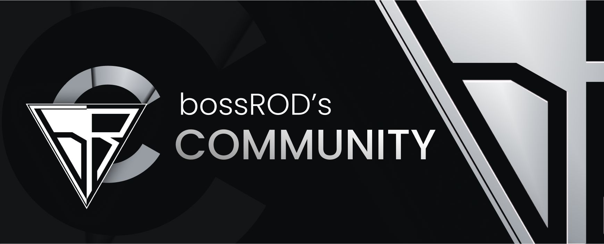

<h1 id="readme-top">MY MENTOR JOURNEY</h1>
<p class="header">This GitHub repository documents my Mentor journey—a collection of coding challenges, solutions, and progress as I sharpen my programming skills.</p>

<p align="center">
  <a href="https://github.com/emailjohnthomascaballero/mentor-training-bossrod">
    
  </a>
</p>

## Table of Contents

<details>
  <summary>VIEW TABLE OF CONTENTS</summary>
  <ol type="I">
    <li><a href="#about">About the Journey</a></li>
    <li><a href="#languages">Languages & Tools Used</a></li>
    <li><a href="#mentor">Mentor Training Plan</a></li>
    <li><a href="#usage">Usage</a></li>
  </ol>
</details>

<p align="right">(<a href="#readme-top">back to top</a>)</p>

<h2 id="about">I. About the Journey</h2>
In this coding journey, I am dedicated to enhancing my logical thinking and algorithmic skills through my Mentor Training program. This repository serves as a comprehensive showcase of all the code I've crafted during this training, highlighting my progress and solutions as I tackle various coding challenges.

<!-- Back to Top -->
<p align="right">(<a href="#readme-top">back to top</a>)</p>

<h2 id="languages">II. Languages and Tools Used</h2>

#### Planning


#### Development


#### Libraries


<!-- Back to Top -->
<p align="right">(<a href="#readme-top">back to top</a>)</p>

<h2 id="mentor">III. Mentor Training Plan</h2>
</p>
Mentor Training Plan: TypeScript, React, and Node

TypeScript (Week 1)

<details>
  <summary>Day 1: Introduction to TypeScript (30-45 minutes)</summary>
  <ul>
    <li>What is TypeScript and why use it?</li>
    <li>Setting up the TypeScript environment with modern tools (Vite + TypeScript)</li>
    <li>Basic types: number, string, boolean, array, tuple</li>
  </ul>
</details>

<details>
  <summary>Day 2: TypeScript Fundamentals I (45-60 minutes)</summary>
  <ul>
    <li>Interfaces and type aliases</li>
    <li>Union and intersection types</li>
    <li>Function types and optional parameters</li>
  </ul>
</details>

<!-- Back to Top -->
<p align="right">(<a href="#readme-top">back to top</a>)</p>

<h2 id="usage">IV. Usage</h2>

_Below is an example of how you can install and setup the application on your device._

1. Clone the repo
   ```sh
   git clone https://github.com/emailjohnthomascaballero/mentor-training-bossrod.git
   ```
   <!-- Back to Top -->
   <p align="right">(<a href="#readme-top">back to top</a>)</p>
